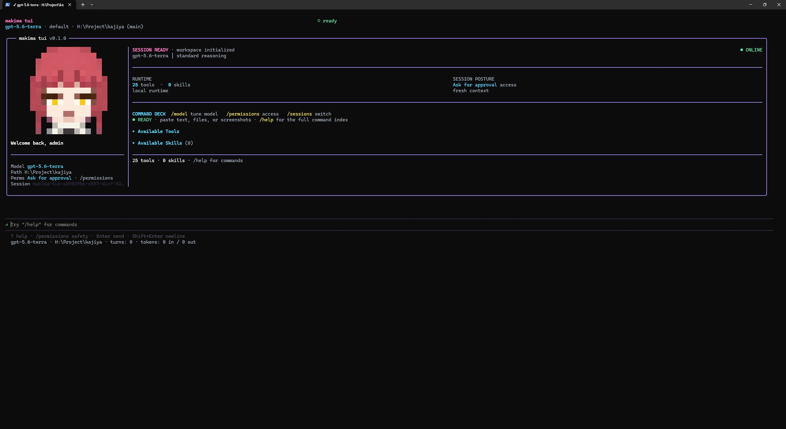
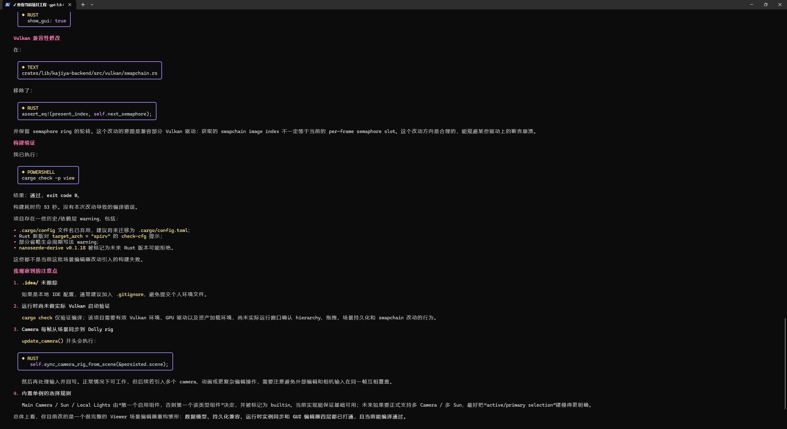
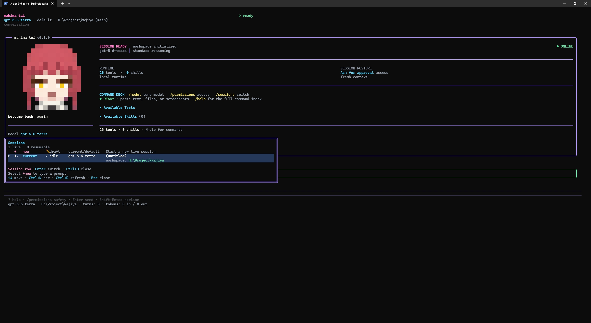
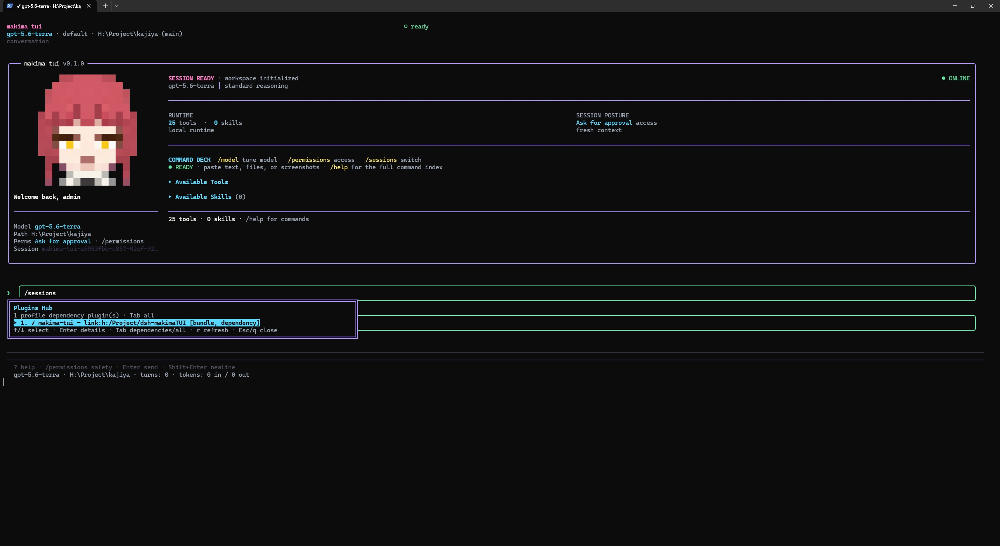
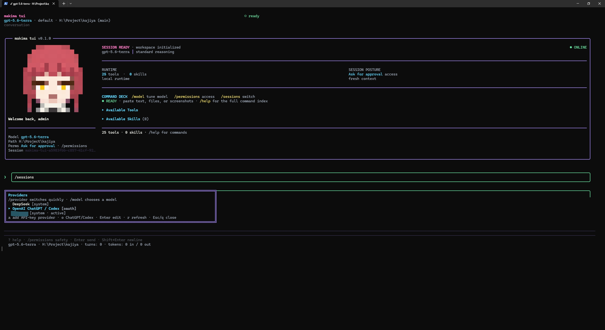

<div align="center">

# ✦ Makima TUI

### 为 [DeepSeek Harness / dsh](https://github.com/deepseek-ai/deepseek-harness) 打造的高密度终端智能体工作台

**流式推理 · 工具执行 · 多 Provider · 会话记忆 · 图片输入 · 可审计的本地优先体验**

[](https://nodejs.org/)
[](LICENSE)
[](https://github.com/deepseek-ai/deepseek-harness)
[](https://github.com/vadimdemedes/ink)

[快速开始](#-快速开始) · [核心能力](#-核心能力) · [会话与插件](#-会话与插件管理) · [Provider 与模型](#-provider-与模型) · [图片输入](#-图片输入) · [命令参考](#-命令参考) · [架构](#-架构)

</div>

> **Makima TUI** 是运行在 dsh 进程内的智能体终端界面。它将对话、推理、工具调用、审批、会话、模型路由与多代理协作收敛到同一个精心打磨的交互界面中：快速、清晰，并且始终保持对执行过程的掌控。

---

## ✨ 为什么是 Makima

| | Makima 的体验 |
|:--|:--|
| **🧠 Agent-native** | 原生承接 Harness 的会话、工具、计划模式、审批与子代理事件，而不是在终端外另起一套协议。 |
| **⚡ 实时可见** | 流式文本、推理片段、工具参数、执行结果、结构化 Diff 与 Token 上下文持续更新。 |
| **🛡️ 保持控制** | 高风险操作可审批；计划可审阅；Provider 密钥与 OAuth 凭据不进入提示词、会话或界面响应。 |
| **🧩 自由接入** | 使用 DeepSeek，也可管理 OpenAI 兼容 API Key Provider，或直接授权 ChatGPT / Codex OAuth。 |
| **🖼️ 不止文本** | Windows 可直接粘贴截图；终端中以 `[Image #N]` 引用呈现，发送时自动成为真实图像内容。 |
| **🎨 为终端而设计** | 深色编辑器质感、精细化状态颜色、鼠标与键盘共存，并兼容 truecolor、ANSI 256 色、亮色与 `NO_COLOR`。 |

---

## 🖼️ 界面预览

> 以下图片均使用仓库内的相对路径；在 GitHub、npm README 预览和本地 Markdown 阅读器中均可直接加载。点击图片可查看原始分辨率。

### 启动工作台

<a href="./screenshots/start.jpeg"></a>

启动页在单个视图内汇总当前模型、工作区、权限、上下文、可用工具与 Skills，并提供模型、权限和会话管理的快捷入口。

### 对话与执行

<a href="./screenshots/main.jpeg"></a>

流式输出保留 Markdown、代码语言标识、工具过程与验证结论，便于在终端中快速审阅智能体工作结果。

### 会话、插件与 Provider 管理

<table>
  <tr>
    <td width="50%" valign="top">
      <a href="./screenshots/sessions.jpeg"></a>
      <strong>Sessions</strong><br />新建、切换、恢复及管理实时和持久化会话。
    </td>
    <td width="50%" valign="top">
      <a href="./screenshots/plugins.jpeg"></a>
      <strong>Plugins Hub</strong><br />查看 profile 插件、角色与依赖，并安全卸载非内置插件。
    </td>
  </tr>
  <tr>
    <td colspan="2" valign="top">
      <a href="./screenshots/provider.jpeg"></a>
      <strong>Providers</strong><br />统一切换系统 Provider、管理 OpenAI 兼容 API Key 路由，以及登录 ChatGPT / Codex OAuth。
    </td>
  </tr>
</table>

---

## 🚀 快速开始

### 前置条件

- Node.js **≥ 22.19**
- npm
- [dsh CLI](https://github.com/deepseek-ai/deepseek-harness)
- 可选：pnpm（仅用于与现有 dsh 环境协作）

### Windows：推荐安装方式

在项目根目录执行：

```powershell
npm install -g @deepseek-ai/dsh
npm install
npm run build
npm run install:windows

dsh --profile makima-tui
```

[`scripts/install-windows.ps1`](scripts/install-windows.ps1) 会将当前项目以 profile 方式安装到本机 dsh 环境；构建完成后，可始终用以下命令进入 Makima：

```powershell
dsh --profile makima-tui
```

### macOS / Linux：手动安装

```sh
npm install -g @deepseek-ai/dsh
npm install
npm run build
./install.sh

dsh --profile makima-tui
```

也可以直接向指定 profile 安装当前插件：

```sh
dsh plugin --profile makima-tui add "$PWD"
dsh --profile makima-tui
```

### 本地启动器

不经由 dsh 命令行时，可使用项目启动器：

```sh
node ./bin/makima-tui.js
```

默认 profile 为 `makima-tui`；可用 `MAKIMA_TUI_PROFILE` 覆盖。

---

## 🧭 核心能力

### 对话与执行

- **流式 Markdown 对话**：实时显示回答、代码、表格与链接。
- **推理可视化**：独立呈现 reasoning 流，不把过程混同于最终回答。
- **工具全过程**：Shell、文件、搜索、网页等 Harness 工具的启动、关键参数、输出与失败原因均可追踪。
- **结构化 Diff**：代码修改以新增 / 删除色彩、hunk 与文件维度展示，降低审阅成本。
- **队列与中断**：运行中可追加 follow-up、steer 当前执行，或用 `Esc` 快速中断。
- **终端内命令**：`!<cmd>` 执行 Shell；`{!<cmd>}` 将命令输出内联到提示词中。

### 规划、审批与问答

- **计划模式**：通过 `/plan` 进入规划工作流，对方案进行确认、反馈或拒绝。
- **审批网关**：Harness 请求执行敏感操作时，TUI 以明确的上下文与可选规则向用户确认。
- **结构化提问**：智能体可提出单选、多选或开放问题；答案会准确映射回当前请求。
- **权限模式切换**：在默认、计划与更高自主性模式之间快速切换，同时保留可见的运行状态。

### 会话、上下文与协作

- **完整会话管理**：`/sessions` 集中浏览实时会话与已持久化历史；可选择、恢复、新建、重命名、关闭和删除会话。
- **多会话并发**：`/sessions new` 在不打断当前运行任务的前提下创建新的实时会话；`Ctrl+X` 也可即时打开切换器。
- **分支与回退**：`/branch [name]` 从当前上下文创建分支；`/undo`、`/retry`、`/rollback` 为对话与工作区提供可逆操作路径。
- **干净的生命周期**：未产生用户对话的临时空会话会在关闭及下次启动时自动清理；仍保留一个可见的初始会话入口。
- **上下文健康度**：显示 Token 使用、上下文窗口占比与本轮活动状态，帮助在压缩前做出判断。
- **目标、Todo 与计划进度**：在对话旁持续显示当前任务推进情况。
- **子代理树**：父子代理、后台委派、工具活动、耗时与产出集中呈现，不丢失主线。

### 插件、Skills 与工具控制

- **Plugins Hub**：`/plugins` 展示当前 dsh profile 的插件清单，包含 bundle、内置与依赖角色信息；可在详情中卸载非内置插件，操作后提示重启 dsh 生效。
- **运行时插件诊断**：`/plugins runtime` 显示每个运行时插件的启用状态、加载阶段与入口 ID，便于定位组合层问题。
- **Skills Hub**：`/skills` 浏览 Skills；支持列出、检查、搜索、安装、浏览社区来源及 `/reload-skills` 热重扫。
- **工具面板**：`/tools enable|disable <name...>` 控制内置或 MCP 工具可用性；`/reload-mcp` 重新加载 MCP 服务。

### 终端交互与视觉

- **双显示模式**：支持 inline scrollback 与 alternate screen，适配不同终端工作流。
- **高保真输入框**：补全、历史、撤销 / 重做、多行输入、词级移动、鼠标选择与右键行为。
- **链接与复制**：终端可点击链接时直接打开；同时提供跨平台剪贴板读写路径。
- **自适应渲染**：兼容 truecolor、ANSI 256 色、亮色背景和 `NO_COLOR`；必要时会安全降级。
- **可定制外观**：品牌粉、信息青、推理紫与语义状态色分层呈现，保持高信息密度下的可读性。

---

## 🧩 Provider 与模型

Makima 将模型路由与凭据管理设计为日常操作，而不是一堆启动参数。

### `/providers`：统一 Provider 管理器

输入 `/providers` 打开管理浮层：

| 操作 | 能力 |
|:--|:--|
| `a` | 新建 OpenAI 兼容 API Key Provider：名称、HTTPS Base URL、模型 ID 与协议一次完成。 |
| `Enter` | 编辑 Makima 创建的 Provider；API Key 留空即保留既有密钥。 |
| `x` | 删除 Makima 自建 Provider（需要确认）；内置 / composition Provider 只读，避免误删。 |
| `o` | 进入 ChatGPT / Codex OAuth 面板。 |

支持的兼容协议：`openai-completions`、`openai-responses`、`anthropic-messages`。保存后 Harness 会动态注册路由，可立即通过 `/provider` 或 `/model` 选用。

> API Key 仅交由 Harness credential service 保存为 `MAKIMA_TUI_PROVIDER_*_API_KEY`。列表、会话、日志与 UI 响应都不会回显密钥文本。

### ChatGPT / Codex OAuth：无 API Key 登录

Makima 内置获授权的 OpenAI OAuth public client。启动后：

1. 输入 `/providers`；
2. 按 `o` 打开 **ChatGPT / Codex** 面板；
3. 按 `b` 打开浏览器完成 PKCE 授权，或按 `d` 使用 Device Code；
4. 授权完成后，在 `/model` 中选择可用模型与推理强度。

浏览器回调固定为 `http://localhost:1455/auth/callback`，仅接受当前单次 PKCE `state` 对应的本地回调。OAuth 面板按 `l` 可退出登录；模型选择器中也可使用 `Ctrl+D` 清除本地 OAuth 会话。

OAuth 凭据保存到 `~/.makima-tui/openai-codex-oauth.json`，可通过 `MAKIMA_OPENAI_CODEX_CREDENTIAL_PATH` 改写位置。凭据不会进入提示词、会话记录、TUI RPC 响应或日志。

同时提供只输出脱敏状态的独立命令：

```sh
makima-tui-auth login openai-codex --browser
makima-tui-auth login openai-codex --device-code
makima-tui-auth status openai-codex
makima-tui-auth logout openai-codex
```

> 模型目录、可选推理强度、额度与 OAuth 行为由 OpenAI 及当前 ChatGPT 账户决定；当服务端能力调整时，Makima 可能需要更新。

### 保持熟悉的快速命令

统一管理器不会破坏原有习惯：

- `/provider <route>`：快速切换 Provider / 路由。
- `/model`：选择模型，并在支持时选择 reasoning effort。
- `/providers`：管理 Provider、API Key 与 OAuth 生命周期。

---

## 🖼️ 图片输入

终端不需要直接渲染像素，也可以可靠地向支持视觉的模型发送图片。

### Windows 截图粘贴

1. 使用 <kbd>Win</kbd> + <kbd>Shift</kbd> + <kbd>S</kbd> 截图；
2. 回到 Makima 输入框后粘贴，或输入 `/paste`；
3. 输入框出现 `[Image #N]`，表示图片已进入当前待发送消息；
4. 正常输入问题并发送。

图片会以 PNG 从 Windows 原生剪贴板读取，保存为 Harness 的**持久附件引用**，而不是把 Base64 直接写进会话日志。发送时，只有输入框中仍存在对应 `[Image #N]` 的图片才会被附加；删除该 chip 即可在发送前取消附件。

对于 OpenAI Responses 路由，Makima 会在请求发送前按需解析附件，并转换为 `input_image`。这使会话记录保持轻量，也让图片在后续恢复会话时仍具备可靠引用。

> 若剪贴板中存在正常文本，Makima 优先粘贴文本；当没有可用文本时才探测图片。图片功能依赖当前 Provider / 模型支持视觉输入。

---

## 🗂️ 会话与插件管理

### Sessions：选择、新增、恢复、删除

输入 `/sessions`（别名 `/session`、`/switch`、`/resume`）打开会话管理器。它同时显示**仍在运行的实时会话**与**已持久化的历史会话**：

| 目标 | 操作方式 |
|:--|:--|
| 新建实时会话 | `/sessions new`；或在会话管理器中选择新建。当前会话若在执行，会继续作为后台实时会话存在。 |
| 选择实时会话 | 在管理器中选择目标会话；也可用 `Ctrl+X` 快速打开实时切换器。 |
| 恢复历史会话 | `/resume <会话 ID 或标题>`，或在管理器中选择历史记录后恢复。 |
| 重命名历史会话 | 在历史会话详情中编辑标题；当前会话也可以使用 `/title <标题>`。 |
| 关闭实时会话 | 在管理器中对实时会话执行关闭；系统会安全选择剩余会话或创建新会话作为回退。 |
| 删除历史会话 | 在历史会话详情中确认删除。活动会话不会被当作历史记录误删。 |
| 新建空白对话 | `/new [标题]`；`/clear` 则确认后清空当前对话上下文。 |

### Plugins Hub：查看与卸载

输入 `/plugins`（别名 `/plugin`）打开插件管理器。默认聚焦当前 profile 的依赖插件，可通过 <kbd>Tab</kbd> 切换到完整插件清单：

1. 使用 <kbd>↑</kbd> / <kbd>↓</kbd> 选择插件，按 <kbd>Enter</kbd> 查看 package、specifier 和角色；
2. 对非内置插件，按 <kbd>Enter</kbd> 或 <kbd>u</kbd> 进入卸载确认；
3. 确认后会从当前 dsh profile 移除该插件；**重启 dsh 后**才会卸载运行中的实例；
4. 内置 bundle 由 dsh 保护，仅可查看，不能卸载。

按 `r` 可刷新插件清单；`/plugins runtime` 可直接查看当前进程内所有插件的启用与加载状态。

---

## ⌨️ 命令参考

> 命令补全、别名和当前 Harness 暴露的附加命令会随运行时动态更新。输入 `/help` 可在 TUI 内查看实时可用列表；下表覆盖 Makima 自带的主要操作面。

### 会话与上下文

| 命令 | 用途 |
|:--|:--|
| `/sessions [new\|<id 或标题>]` | 浏览、切换或恢复会话；`/session`、`/switch`、`/resume` 为别名。 |
| `/new [标题]` | 新建会话；`/clear` 确认后清空当前会话。 |
| `/title [标题]` | 查看或设置当前会话标题。 |
| `/branch [名称]` | 从当前上下文创建会话分支；`/fork` 为别名。 |
| `/compress [主题]` | 压缩当前会话的历史上下文。 |
| `/history [预览字符数]` | 查看当前对话记录。 |
| `/save` | 将当前对话导出为 JSON。 |
| `/undo` / `/retry` | 撤销最后一轮交互，或重试最后一条用户消息。 |
| `/usage` / `/status` | 查看 Token、上下文窗口与当前会话状态。 |
| `/rollback [list\|diff <n>\|restore <n>]` | 查看、比较或还原工作区检查点。 |

### 模型、Provider 与权限

| 命令 | 用途 |
|:--|:--|
| `/providers` | 管理 API Key Provider 与 ChatGPT / Codex OAuth。 |
| `/provider <route>` | 快速切换 Provider / 路由。 |
| `/model [模型 [--provider <slug>]]` | 打开模型选择器，或直接切换模型。 |
| `/reasoning [级别\|show\|hide]` | 查询 / 设置推理强度与推理展示。 |
| `/permissions [ask\|approve\|full]` | 打开权限选择器或设置执行权限；`/mode` 为别名。 |
| `/yolo` | 切换当前会话的快速审批模式。 |
| `/fast [normal\|fast\|status]` | 查询或切换服务速度模式。 |
| `/personality <名称>` | 切换当前会话人格配置。 |

### 插件、Skills、代理与工具

| 命令 | 用途 |
|:--|:--|
| `/plugins [runtime]` | 打开 Plugins Hub；`runtime` 显示运行时插件加载状态；`/plugin` 为别名。 |
| `/skills [list\|inspect <名称>\|search <关键词>\|install <名称或 URL>\|browse [页码]]` | 浏览、检索、检查或安装 Skills。 |
| `/reload-skills` | 重新扫描已安装 Skills，并刷新命令目录。 |
| `/agents [pause\|resume\|status]` | 打开子代理树，或直接暂停 / 恢复委派；`/tasks` 为别名。 |
| `/replay [N\|last\|list\|load <路径>]` | 回放已完成的子代理树快照。 |
| `/replay-diff <基线> <候选>` | 比较两个已完成的子代理树。 |
| `/tools enable\|disable <名称...>` | 启用或停用内置 / MCP 工具。 |
| `/reload-mcp [now\|always]` | 重载当前会话的 MCP 服务。 |
| `/stop` | 停止后台进程。 |

### 输入、媒体与工作流

| 命令 | 用途 |
|:--|:--|
| `/paste` | 从剪贴板附加图片；普通文本继续走正常粘贴路径。 |
| `/image <路径>` | 附加本地图片。 |
| `/prompt [文本]` | 在 `$EDITOR` 中编写下一条提示词；`/compose` 为别名。 |
| `/queue [消息]` | 查看或追加待发送消息；`/q` 为别名。 |
| `/steer <提示>` | 在下一次工具调用后引导当前执行，不中断回合。 |
| `/background <提示>` | 启动后台提示词任务；`/bg`、`/btw` 为别名。 |
| `/plan` | 进入 Harness 计划模式（由运行时命令目录提供）。 |
| `/memory [status\|pending\|approve <id\|all>\|reject <id\|all>]` | 打开记忆文件选择器，或管理有界记忆存储。 |
| `/browser [connect [url]\|disconnect\|status]` | 管理 Chromium CDP 浏览器连接。 |
| `/change-center` | 检查 Git、Perforce 或 Subversion 工作区变更。 |
| `/quality-gate` | 显示最近一次验证 / 质量门禁结果。 |

### 界面、终端与诊断

| 命令 | 用途 |
|:--|:--|
| `/help` | 显示按分类组织的命令与快捷键。 |
| `/details [hidden\|collapsed\|expanded\|cycle]` | 控制推理、工具、子代理等详情区域可见性。 |
| `/compact [on\|off\|toggle]` | 切换紧凑转录布局。 |
| `/statusbar [on\|off\|top\|bottom\|toggle]` | 设置状态栏位置；`/sb` 为别名。 |
| `/mouse [on\|off\|wheel\|buttons\|all]` | 配置鼠标追踪模式；`/scroll` 为别名。 |
| `/redraw` | 强制完整重绘终端 UI。 |
| `/terminal-setup [auto\|vscode\|cursor\|windsurf]` | 安装 IDE 终端的多行 / 撤销重做键位配置。 |
| `/logo`、`/skin`、`/indicator` | 配置启动 Logo、皮肤与忙碌指示器。 |
| `/logs [行数]` | 查看 Gateway 日志尾部。 |
| `/mem` / `/heapdump` | 输出 Node.js 内存诊断，或写入 V8 堆快照。 |
| `/quit` | 退出 Makima；`/exit` 为别名。 |

---

## ⌨️ 快捷操作

| 快捷键 / 语法 | 动作 |
|:--|:--|
| `Esc` | 中断当前运行中的回合。 |
| `Tab` | 接受补全。 |
| `↑` / `↓` | 浏览补全、编辑队列或调用输入历史。 |
| `Ctrl+X` | 打开实时会话切换器；编辑中会删除待发送队列消息。 |
| `Ctrl+L` | 重新绘制 / 刷新终端画面。 |
| `Ctrl+A` / `Ctrl+E` | 跳到行首 / 行尾。 |
| `Ctrl+Z` / `Ctrl+Y` | 撤销 / 重做输入编辑。 |
| `Ctrl+W` | 删除前一个词。 |
| `Ctrl+U` / `Ctrl+K` | 删除至行首 / 行尾。 |
| `Ctrl+←` / `Ctrl+→` | 按词移动光标。 |
| `Shift+Enter` 或 `Alt+Enter` | 插入换行。 |
| `\+Enter` | 多行续写的兼容回退方式。 |
| 平台粘贴键 / `/paste` | 粘贴文本；当剪贴板只有图片时，`/paste` 附加图片。 |
| `!git status` | 在终端中执行 Shell 命令。 |
| `{!git status}` | 将 Shell 输出内联进提示词。 |

`Ctrl` 在 macOS 上会按平台习惯映射为 `Cmd`（粘贴快捷键也依终端能力而定）。完整键位定义见 [`src/content/hotkeys.ts`](src/content/hotkeys.ts)。

---

## 🏗️ 架构

Makima 不是通过子进程模拟智能体，而是作为 dsh 的 Cordis 插件**进程内运行**：

```text
dsh / Cordis Runtime
└── @deepseek-ai/dsh-base
    └── makima-tui plugin
        ├── HarnessGatewayClient     适配 Harness 事件与 RPC
        ├── React + Ink              终端 UI
        ├── Provider / OAuth Runtime 模型与凭据生命周期
        └── Attachment Store         持久图片附件
```

- [`src/harness/index.ts`](src/harness/index.ts) 负责插件入口与运行时安装。
- [`src/harness/client.ts`](src/harness/client.ts) 的 `HarnessGatewayClient` 将 Harness 会话、代理、工具、审批与流式事件转换为稳定的 UI Gateway 契约。
- [`src/harness/openAiCodexAdapter.ts`](src/harness/openAiCodexAdapter.ts) 实现 OpenAI Responses 流式适配与图像内容序列化。
- [`cordis.patch.yml`](cordis.patch.yml) 保持组合层最小化；Makima 不修改上游 Harness 源码。
- dsh 的会话持久化与附件存储仍由 Harness 负责，Makima 专注于界面和适配边界。

详见 [`docs/ARCHITECTURE.md`](docs/ARCHITECTURE.md)。

---

## ⚙️ 配置

常用环境变量均使用 `MAKIMA_TUI_` 前缀：

| 变量 | 说明 |
|:--|:--|
| `MAKIMA_TUI_THEME=light\|dark` | 选择终端明暗主题。 |
| `MAKIMA_TUI_INLINE=0` | 使用 alternate screen；默认保留 inline scrollback。 |
| `MAKIMA_TUI_HOME` | Makima 数据目录，默认 `~/.makima-tui`。 |
| `MAKIMA_TUI_WORKSPACE` | 显式指定工作目录。 |
| `MAKIMA_TUI_RESUME` | 启动时恢复指定会话。 |
| `MAKIMA_TUI_FPS=1` | 显示 FPS 诊断信息。 |
| `MAKIMA_TUI_TRUECOLOR=1` | 显式启用 truecolor。 |
| `MAKIMA_TUI_PROFILE` | 供本地启动器覆盖默认 dsh profile。 |
| `MAKIMA_OPENAI_CODEX_CREDENTIAL_PATH` | 覆盖本地 OAuth 凭据文件路径。 |

<details>
<summary><strong>高级：私有 OAuth client / 端点覆盖</strong></summary>

<br />

只有在开发、私有部署，或使用自己已获授权的 OAuth client 时才应覆盖以下值。修改 client、scope 或 redirect URI 前，请确认它们已在 OAuth 应用中注册并获得相应 grant 权限。

```sh
export MAKIMA_OPENAI_CODEX_CLIENT_ID='your-authorized-client-id'
export MAKIMA_OPENAI_CODEX_REDIRECT_URI='http://localhost:1455/auth/callback'
export MAKIMA_OPENAI_CODEX_API_BASE_URL='https://your-authorized-codex-endpoint'
export MAKIMA_OPENAI_CODEX_AUTHORIZE_URL='https://auth.openai.com/oauth/authorize'
export MAKIMA_OPENAI_CODEX_TOKEN_URL='https://auth.openai.com/oauth/token'
export MAKIMA_OPENAI_CODEX_SCOPES='openid profile email offline_access'
export MAKIMA_OPENAI_CODEX_ORIGINATOR='makima-tui'
export MAKIMA_OPENAI_CODEX_DEVICE_AUTHORIZE_URL='https://your-authorized-oauth-endpoint/device-authorize'
export MAKIMA_OPENAI_CODEX_DEVICE_TOKEN_URL='https://your-authorized-oauth-endpoint/device-token'
export MAKIMA_OPENAI_CODEX_DEVICE_VERIFICATION_URI='https://your-authorized-device-verification-page'
export MAKIMA_OPENAI_CODEX_DEVICE_REDIRECT_URI='https://your-authorized-oauth-endpoint/device-callback'
```

</details>

### DeepSeek 凭据

Makima 不自行保存 DeepSeek API Key。Harness 从 dsh 的凭据存储读取：

```yaml
DEEPSEEK_API_KEY: sk-...
```

默认文件为 `~/.dsh/.credentials.yaml`。建议将 `~/.dsh` 设为权限 `700`，凭据文件设为 `600`；也可使用 `DEEPSEEK_API_KEY=sk-... dsh --profile makima-tui` 临时覆盖。

---

## 🛠️ 开发

```sh
npm install
npm run typecheck
npm test
npm run build
```

| 命令 | 用途 |
|:--|:--|
| `npm run dev` | 构建 Ink 依赖并以 watch 模式启动本地界面。 |
| `npm run typecheck` | 执行 TypeScript 静态检查。 |
| `npm test` | 运行 Vitest 测试集。 |
| `npm run build` | 构建 Ink 运行时和 dsh 插件产物。 |
| `npm run build:plugin` | 仅构建插件 bundle。 |
| `npm run install:windows` | 在 Windows 安装 / 更新本地 Makima dsh profile。 |
| `npm run verify:boundary` | 验证 Harness 适配边界。 |
| `npm run e2e` | 构建后执行核心端到端验证。 |

主要目录：

```text
src/harness/              dsh / Harness、Provider、OAuth 与附件适配层
src/app/                  应用状态、会话生命周期与交互控制
src/components/           TUI 视觉组件与编辑器输入
src/protocol/             Composer、图片引用与粘贴协议
src/theme.ts              Makima 主题与终端色彩兼容层
packages/makima-tui-ink/  内置 Ink 渲染器副本
```

---

## 🎨 视觉语言

Makima 的默认主题采用深色编辑器底色，以高对比、低噪声的语义颜色组织复杂执行信息：

| 角色 | 色值 | 用途 |
|:--|:--|:--|
| 背景 | `#000000` | 沉浸式终端基底。 |
| 品牌主色 | `#E84393` | Makima 识别与关键交互。 |
| 信息 | `#7DD3E8` | 导航、链接与辅助信息。 |
| 边框 / 推理 | `#B366FF` | 面板结构、推理元数据。 |
| 成功 | `#00FF9C` | 已完成、通过与新增状态。 |
| 错误 | `#FF3B6B` | 失败、风险与删除状态。 |
| 警告 | `#FFD060` | 需要注意或确认的状态。 |
| 主文字 | `#EEEAF4` | 长文本与代码阅读。 |
| 次要文字 | `#7E7888` | 低优先级元数据。 |

---

## 📄 许可与致谢

Makima TUI 使用 [MIT License](LICENSE)。部分 TUI 实现参考并吸收 MIT 许可的 clawcodex ui-tui 与 dsh-TUI；完整归属与说明请见 [`NOTICE.md`](NOTICE.md)。
